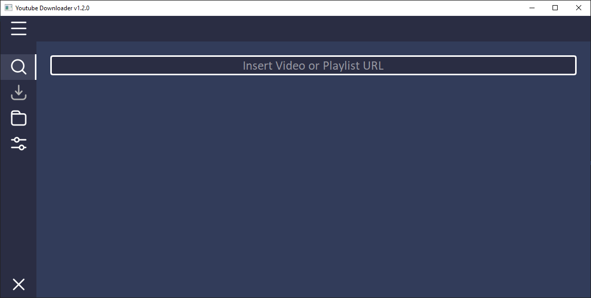
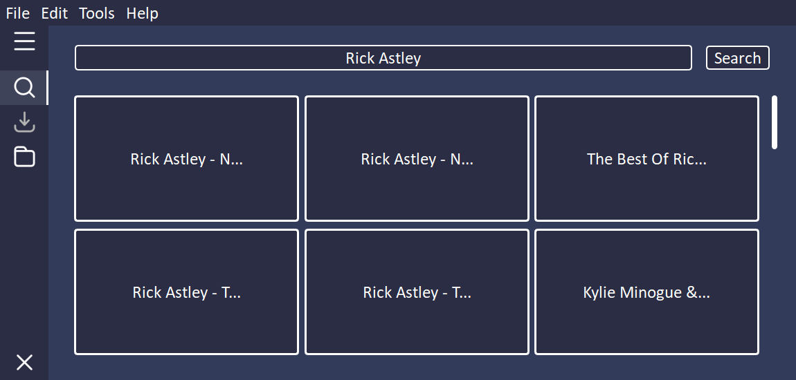
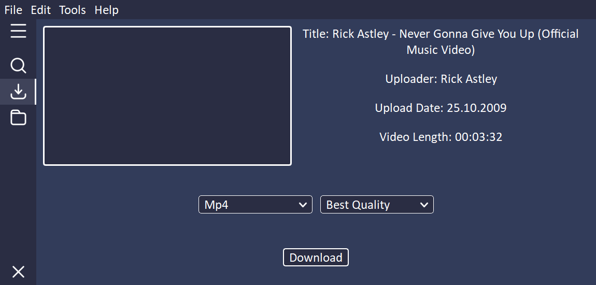
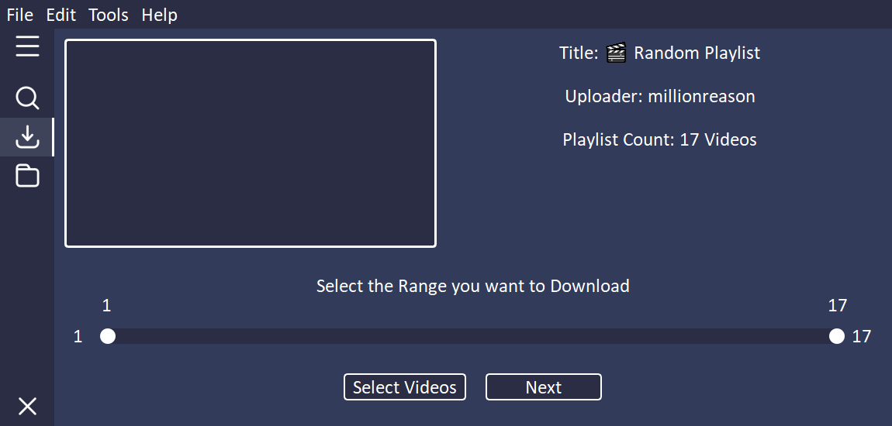
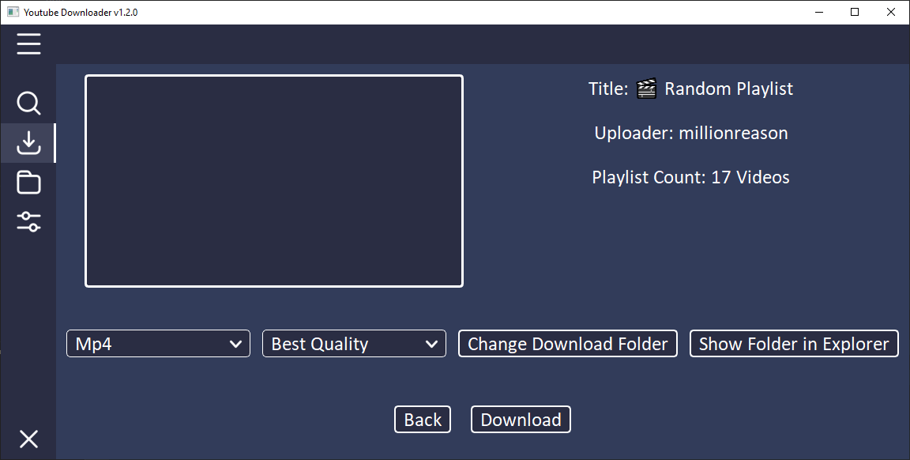
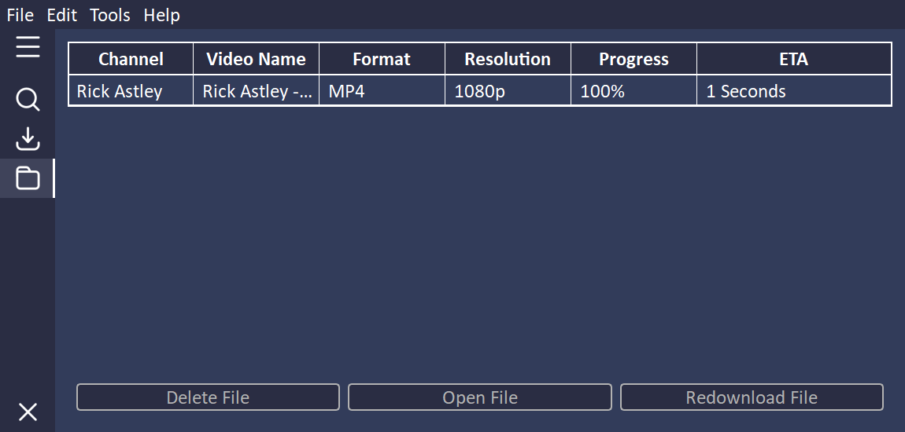

YOUTUBE DOWNLOADER

- [INSTALLATION](#installation)
- [USAGE](#usage)
- [SHOWCASE](#showcase)
- [Credits](#credits)

# Installation:

- Download the [latest version](https://github.com/PyFlat/YT-Downloader/releases/latest)
- Portable:
  - Unzip the .zip folder
  - Execute the .exe file
- Installer:
  - Execute the .exe installer
  - Follow the installation steps
  - Start the downloader

# Usage:

- Let the downloader install [ffmpeg](https://ffmpeg.org/) and [yt-dlp](https://github.com/yt-dlp/yt-dlp) on first use
- Add a video or playlist URL or a search term to the entry
- Wait until the downloader has loaded the information

- ### Video:
  - Select the output format (mp3, mp4)
  - Choose the resolution if you want to download mp4
  - Press Download and wait until you see the button again, then you can download more videos or another format
- ### Playlist:
  - Choose which range of the playlist should be downloaded
  - Click on next
  - Select the output format (mp3, mp4)
  - Select the output folder, this is by default the /Download folder
  - Press Download and wait until you see the button again, then you can download more videos or another format
- ### Search:
  - Wait until the results are displayed (Can take a bit with slow Wifi)
  - With left click you can open a video in the download page
  - With right click you can see the uploader and title of the video
- ### Menubar:

  - **File**
    - _Change Download Folder:_ Set the folder in which the downloaded files are saved
    - _Reveal in File Explorer:_ Opens the current download folder in explorer
    - _Open Log-Files Folder:_ Opens the folder in which the saved log files are located
  - **Edit**
    - _Auto Update Check:_ Automatically searches for updates
    - _Show Thumbnails:_ If set to false no thumbnails will be loaded -> _faster_
    - _Default Resolution:_ Set the default resolution for downloading a video
    - _Maximum Threads:_ Set the maximum number of videos that can be downloaded at the same time (If you add more videos they will be added to the queue)
    - _Change Log-Level:_ Set the amount of information the developer receives. With debug, personal data may be passed on
  - **Tools**
    - _Set FFmpeg-Path:_ Set the path to your local ffmpeg location
    - _Download FFmpeg:_ Automatically downloads and installs the latest FFmpeg version (**Warning:** Overwrites FFmpeg location)
    - _Update Yt-dlp:_ Automatically downloads and installs the latest yt-dlp version
  - **Help**
    - _Search for Updates:_ Searches for a new version of _PyFlat Youtube Downloader_
    - _Show on GitHub:_ Opens the repository on GitHub
    - _Show Changelog:_ Shows the changelog for the current version

- **The download speed depends on the internet connection and the length and resolution of the video!**

# Showcase:

All images were created with the _Show-Thumbnails_ setting: **Off**

## Start-Page

## Search-Page

## Download-Page for videos

## Range-Selection-Page for playlists

## Download-Page for playlists

## Download-Control-Page

# Credits:

- <a href="https://github.com/Make-Lemonade/iconicicons">Menu, Search, Download, Folder, Settings, Exit, Dropdown Arrow - Icons</a>
- <a href="https://github.com/twbs/icons">Checkbox Icon</a>
