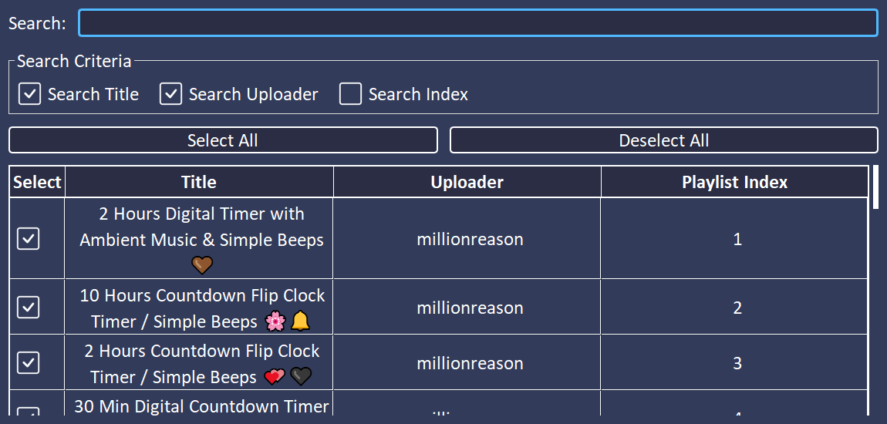

    <h1>PyFlat YouTube Downloader</h1>

---

## Table of Contents

- [Introduction](#introduction)
- [Installation](#installation)
  - [Portable Installation](#portable-installation)
  - [Installer Installation](#installer-installation)
- [Usage](#usage)
  - [Downloading Videos](#downloading-videos)
  - [Downloading Playlists](#downloading-playlists)
  - [Searching](#searching)
  - [Menu Bar Functions](#menu-bar-functions)
- [Languages](#languages)
- [Showcase](#showcase)
- [Credits](#credits)

---

## Introduction

PyFlat YouTube Downloader is a user-friendly tool designed to download videos and playlists from YouTube. It offers convenient features such as format selection, resolution options, and playlist downloading.

---

## Installation

### Portable Installation

1. Download the [latest version](https://github.com/PyFlat/YT-Downloader/releases/latest)
2. Unzip the downloaded .zip folder
3. Execute the .exe file

### Installer Installation

1. Download the [latest version](https://github.com/PyFlat/YT-Downloader/releases/latest)
2. Run the .exe installer
3. Follow the installation steps
4. Launch the downloader after installation

---

## Usage

### Downloading Videos

1. Add the video URL to the input field
2. Choose the output format (mp3 or mp4)
3. Select the desired resolution (for mp4)
4. Click Download and wait for completion

### Downloading Playlists

1. Add the playlist URL to the input field
2. Specify the videos you want to download:
   - **Range Selection:** Choose a range of videos to download.
   - **Precise Selection:** Manually select individual videos to download.
3. Proceed to the next step
4. Choose the output format (mp3 or mp4)
5. Select the output folder (default is /Download)
6. Click Download and wait for completion

### Searching

1. Enter a search term in the input field
2. Wait for the results to load
3. Left-click to open a video on the download page
4. Right-click to view video details

### Menu Bar Functions

#### File

- **Change Download Folder:** Set the download directory
- **Reveal in File Explorer:** Open the download folder in explorer
- **Open Log-Files Folder:** Open the folder containing log files

#### Edit

- **Auto Update Check:** Automatically check for updates
- **Show Thumbnails:** Toggle thumbnail loading for faster performance
- **Default Resolution:** Set the default resolution for video downloads
- **Maximum Threads:** Adjust the maximum simultaneous downloads
- **Change Log-Level:** Control the level of developer information
- **Change Language:** Switch the language of the application

#### Tools

- **Set FFmpeg Path:** Set the path to local ffmpeg installation
- **Download FFmpeg:** Automatically download and install the latest FFmpeg version (warning: overwrites existing ffmpeg)
- **Update Yt-dlp:** Automatically download and install the latest yt-dlp version

#### Help

- **Search for Updates:** Search for new versions of the downloader
- **Show on GitHub:** Open the repository on GitHub
- **Show Changelog:** View the changelog for the current version

## Languages

You can contribute to the expansion of language options in the application. Below are the steps to contribute a new language:

1. Fork the repository [here](https://github.com/PyFlat/YT-Downloader/fork).
2. Navigate to the `languages` directory.
3. Duplicate the `language_en.properties` file and rename it with the appropriate language code (e.g., `language_fr.properties` for French).
4. Translate the strings in the file to the desired language.
5. Submit a pull request with your changes.

### Available Languages

- **English (en)**
- **German (de)**

#### If you're fluent in a language not listed here, we welcome your contribution to add it to our supported languages!

---

## Showcase

### Start Page

### Search Page

### Download Page for Videos

### Range Selection Page for Playlists

### Precise Selection Dialog for Playlists

### Download Page for Playlists

### Download Control Page

---

## Credits

- [Icons for Menu, Search, Download, Folder, Exit, Dropdown Arrow](https://github.com/Make-Lemonade/iconicicons)
- [Checkbox Icon](https://github.com/twbs/icons)
- [yt-dlp](https://github.com/yt-dlp/yt-dlp): A youtube-dl fork for downloading YouTube videos.
