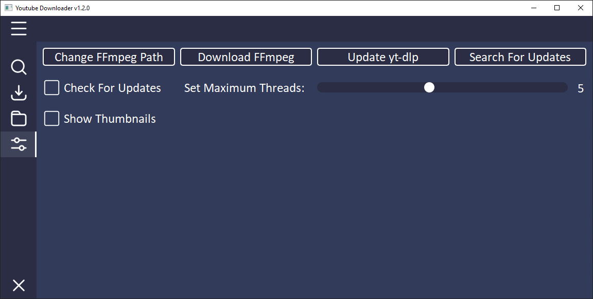

YOUTUBE DOWNLOADER

* [INSTALLATION](#installation)
* [USAGE](#usage)
* [SHOWCASE](#showcase)
* [Credits](#credits)

# Installation:
- Download the [latest version](https://github.com/PyFlat/YT-Downloader/releases/latest)
- Portable:
  - Unzip the .zip folder
  - Execute the .exe file
- Installer:
  - Execute the .exe installer
  - Follow the installation steps
  - Start the downloader

# Usage:
- Let the downloader install [ffmpeg](https://ffmpeg.org/) and [yt-dlp](https://github.com/yt-dlp/yt-dlp) on first use
- Add a video or playlist URL or a search term to the entry
- Wait until the downloader has loaded the information
- ### Video:
  - Select the output format (mp3, mp4)
  - Choose the resolution if you want to download mp4
  - Select the output folder, this is by default the /Download folder
  - Press Download and wait until you see the button again, then you can download more videos or another format
- ### Playlist:
  - Choose which range of the playlist should be downloaded
  - Click on next
  - Select the output format (mp3, mp4)
  - Select the output folder, this is by default the /Download folder
  - Press Download and wait until you see the button again, then you can download more videos or another format
- ### Search:
  - Wait until the results are displayed (Can take a bit with slow Wifi)
  - With left click you can open a video in the download page
  - With right click you can see the uploader and title of the video
- ### Settings:
  - **Change FFmpeg Path:** Set the path to your local ffmpeg location
  - **Download FFmpeg:** Automatically downloads and installs the latest FFmpeg version (**Warning:** Overwrites FFmpeg location)
  - **Update yt-dlp:** Automatically downloads and installs the latest yt-dlp version
  - **Search For Updates:** Searches for a new version of *PyFlat Youtube Downloader* and shows a link if a new version is available
  - **Check for Updates:** If this is checked the downloader automatically searches for updates
  - **Set Maximum Threads:** Set the maximum number of videos that can be downloaded at the same time (If you add more videos they will be added to the queue)
  - **Show Thumbnails:** If set to false no thumbnails will be loaded -> *faster*

- The download speed depends on the internet connection and the length and resolution of the video!

# Showcase:
All images were created with the *Show Thumbnails* setting: Off
## Start

## Search

## Download-Page for videos

## Range-Selection-Page for playlists

## Download-Page for playlist

## Download control window

## Settings

# Credits:
- <a href="https://github.com/Make-Lemonade/iconicicons">Menu, Search, Download, Folder, Settings, Exit, Dropdown Arrow - Icons</a>
- <a href="https://github.com/twbs/icons">Checkbox Icon</a>

